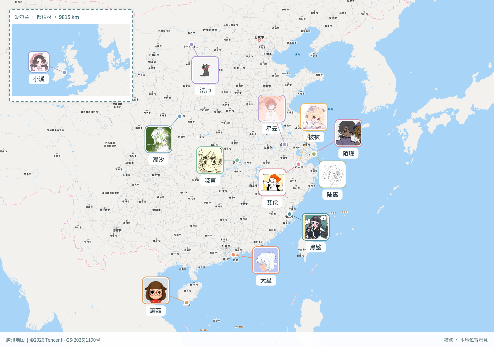

# 被汐

和好朋友们一起打开位置共享，看着熟悉的头像出现在同一张地图上，即使彼此相隔很远，也会觉得靠近了一点。

「被汐」就是为了模拟这一刻的开心而开发的小项目。把朋友们的头像、名字和所在的地方放在一起，让散落在不同城市、甚至不同国家的大家，在地图上相聚，再把这份快乐保存成一张图片。

## v1.1.1 新增内容与下载

[GitHub Releases](https://github.com/xlxDH/BeiXi/releases/tag/v1.1.1) 提供分类附件和SHA256校验值。

- 中文名称统一为“被汐”，包括页面、导出图片和移动端应用名称。
- 腾讯大陆 + MapLibre/MapTiler 海外地图、自动/手动切换，地点查询默认MapTiler。
- 统一WGS84与旧快照迁移，蘑菇enter更新为三亚海南热带海洋学院附近参考点。
- 2560×1800双底图导出、可拖动预览、各服务署名保留。
- 地图服务设置可填写自己的Key；发布构建清空本机凭据。
- Windows10/11 x64与macOS Intel/AppleSilicon免安装开发环境的启动包，Android测试签名APK，iOS未签名工程。

| 附件 | 使用方法 |
| --- | --- |
| Source code | 解压，Node.js22.12+，npm ci后按下文启动 |
| windows10-11-x64.zip | 解压，双击Start-BeiXi.cmd，自动打开浏览器 |
| macos-intel / macos-apple-silicon.tar.gz | macOS13.5+，解压并双击Start-BeiXi.command；未公证脚本可右键打开 |
| android-test-signed.apk | Android7+测试版，允许安装来源后安装；测试证书变更可能需要卸载重装 |
| ios-unsigned-project.zip | 不是IPA；macOS+Xcode26+打开ios/App/App.xcodeproj，自行选择签名Team |

桌面包内置Node24.11.1，仅监听127.0.0.1:41731，保留启动窗口运行，关闭即停止；不注册开机启动。首次使用点右上角“地图服务设置”，填入自己的MapTiler/腾讯浏览器Key。白名单需允许桌面http://127.0.0.1:41731、Android https://localhost、iOS capacitor://localhost（服务商是否接受该来源需实际验证）。发布包不包含腾讯SK，签名查询用自行配置的源码版；可优先使用MapTiler搜索。

APK由CI测试签名生成，不用于应用商店；卸载会删除应用数据，地图/定位/分享未在真机验收。iOS当前没有Apple开发者账号，因此仅发布未签名工程，不宣称可直接安装，也未在Xcode验证。更多说明见[发行说明](docs/release-v1.1.1.md)。

## 示例图



*示例中的昵称与位置可自行编辑，实际显示以当前设置为准。*

## 项目说明

基于 Vue 3、TypeScript、Vite 、腾讯地图 JavaScript GL API 与 MapLibre GL JS 的纯前端本地演示。地图上的 12 位成员是模拟数据，不代表真实用户，不进行多人位置同步。

默认成员与头像按 `src/photos/1.jpg` 至 `src/photos/12.jpg` 。城市位置使用代表性中心点，校园与园区位置为近似点，仅用于界面演示；杭州两位成员共享同一城市参考点，界面自动错开头像并用连线指向坐标。

首次打开使用上述十二位成员。修改成员后点击“保存为默认”，会保存成员、头像、地图中心与缩放、右侧面板及底部头像列表的展开状态；刷新恢复最后保存的快照。未保存的改动只留在本次页面。默认设置仅存在当前浏览器，清除网站数据后恢复内置名单。

固定经纬度为对应地点附近的模拟参考点，并非个人实时定位或经授权的精确测绘结果。蘑菇enter现为“海南 · 三亚市 · 海南热带海洋学院”，使用MapTiler返回的三亚学院路附近WGS84参考点（18.313372, 109.542620），尚非校内精确定位；原样保存的厦门默认位置会在读取时更新，手工改过的位置保留。

## 启动

要求 Node.js 22.12 及以上版本，以及 npm；进行版本管理还需安装 Git。建议使用 Node.js 22 或 24 LTS。

在项目根目录安装锁文件中指定的依赖：

```sh
npm ci
```

首次配置时，复制 `.env.example` 为 `.env.local`（已有配置时不要覆盖）。Windows PowerShell：

```powershell
Copy-Item .env.example .env.local
```

macOS / Linux：

```sh
cp .env.example .env.local
```

在 `.env.local` 中填写自己的地图服务凭据：

```dotenv
VITE_TENCENT_MAP_KEY=your_key
VITE_TENCENT_MAP_SK=your_sk
VITE_MAPTILER_KEY=your_maptiler_public_key
# 可选：自托管样式地址优先于 MapTiler 底图
VITE_OVERSEAS_STYLE_URL=
VITE_OVERSEAS_ATTRIBUTION=
```

Key 用于地图 SDK 和 WebService；SK 用于启用签名校验的 WebService 请求。权限及签名要求见下方“腾讯服务配置”。`.env.local` 被 Git 忽略，`.env.example` 仅保留占位值。修改配置后需要重启 Vite。

启动开发服务：

```sh
npm run dev
```

打开终端中 Vite 给出的本地地址，通常为 `http://127.0.0.1:5173`。开发与预览服务默认仅监听本机。不配置有效 Key 时可查看本地示意图；国内地图需要腾讯服务可用；海外需要 MapTiler Key 或可访问的自托管样式。

## 开发与验证

| 命令 | 用途 |
| --- | --- |
| `npm ci` | 按 `package-lock.json` 安装依赖，适用于首次拉取及干净安装 |
| `npm run dev` | 启动本地开发服务 |
| `npm run build:release` | 不加载本机环境配置，清空凭据，构建至dist-release/ |
| `npm run native:sync` | 干净发布构建并同步Android/iOS工程；需Node22.12+ |
| `npm run build` | 执行 Vue / TypeScript 类型检查并构建至 `dist/` |
| `npm run preview` | 在本机预览已生成的 `dist/`，需先构建 |
| `node tests/maps.mjs` | 验证地区选择、WGS84/GCJ02转换及旧快照迁移 |
| `node tests/connections.mjs` | 验证连接线边界、自身裁切与交叉判定 |

提交代码前建议执行：

```sh
node tests/connections.mjs
node tests/maps.mjs
npm run build
```

连接线测试不访问腾讯服务，不能替代浏览器交互验证。修改地图或导出功能时，还应检查桌面、窄屏和横屏下的成员展示、保存后刷新恢复，以及智能分区和当前视图导出。历史验证记录见 [VERIFICATION.md](VERIFICATION.md)，其中提及的截图属于本地验证产物，默认不纳入 Git。

## 功能与操作

- 地图仅显示照片和姓名；所有照片位于姓名层上方，连接线与坐标点位于两者上方。某条连接线穿过其他成员的头像或姓名时，该成员的头像与姓名固定为60%不透明度；自己的连接线不触发变淡，并在自己的照片边缘停止。地图移动、缩放和重新排布后重新判定，交叉消失即恢复；PNG智能、当前视图和插图使用同一规则。
- 添加、编辑、删除成员，设置照片、姓名、地点文字、经纬度及 RGB 颜色。删除前确认，姓名最长40字、地点最长120字，纬度范围 -85 至85，经度范围 -180 至180，RGB 为0至255整数，最多80位成员。
- 头像在本机裁切为256×256 JPEG后保存；不上传到头像服务。保存失败会显示错误，保留原来的默认快照。无法读取或校验失败的数据会回退到内置名单。
- 右侧名单和底部12张头像堆叠可展开或收起；展开后可点击成员定位。屏幕内的头像自动避让，连接线指向原始地理位置；排布不会改写坐标。小屏幕或成员数量超过容纳能力时，可通过名单逐个查看。
- “保存为默认”明确保存当前设置；顶栏和右侧面板都可操作。未保存的编辑刷新后不保留。
- “导出图片”提供智能分区及当前视图：智能分区以多数成员所在地区为主图，远处地区作为虚线框插图。生成真实地图底图、头像、姓名、坐标点与各地图服务署名的 PNG，预览后下载；网络或地图截图失败会明确报错，不以示意背景冒充真实地图。
- 导出尺寸为2560×1800：地图在两倍画布上重新渲染，头像和文字同步按比例绘制。智能模式先分国内/海外，再按2500公里邻近关系分区，最多主图加4个远方小窗；爱尔兰小窗显示爱尔兰与大不列颠全岛和周边海域，头像移至西侧海面并保留连接线。没有足够空白区域或过于拥挤时提示调整成员。当前视图模式按比例保留地图范围和屏幕头像位置，必要时留白。智能模式中大陆分区使用腾讯、海外分区使用 MapLibre；当前视图模式保留当前选择的地图服务。跨日期变更线的合并分区会明确提示改用单侧当前视图。
- 地点查询默认使用 MapTiler Geocoding（搜索框的“海外”选项），也可手动选择“国内”使用腾讯 WebService。服务不可用时仍可编辑成员经纬度。设备定位、成员编辑和保存统一使用 WGS84，仅在腾讯地图/搜索的适配边界转换 GCJ02。
- 地图下拉菜单提供自动切换、腾讯地图、海外地图。自动模式按地图中心选择服务；选成员、搜索和拖动结束后会切换。单个视图使用一种底图，跨洲全景按中心选取；智能导出可以组合不同服务的主图与插图。

## 腾讯服务配置

在腾讯位置服务控制台中，确保 Key 开通 JavaScript API 和 WebServiceAPI，按控制台要求配置允许的域名 / 来源。此项目通过 JSONP 请求 WebService，并使用排序后的原始参数与路径、SK 计算 MD5 签名，然后编码 URL。Key 未开通权限或签名配置不匹配时，页面显示腾讯返回的错误。

浏览器无法隐藏 SK：`VITE_` 环境变量会被打包到浏览器脚本，网络签名与源码均可被查看。本方案仅适用于本地演示；公开上线需将 WebService 签名和请求移至服务端，使用单独的受限客户端地图 Key。不要提交 `.env.local` 或公开含 SK 的构建产物。

地图 SDK 加载失败时自动显示明确标注的本地示意图。示意图不是腾讯地图或真实地理底图，成员标记仍按经纬度投影供界面演示；在线模式使用对应服务的地图投影，标记跟随地图平移缩放。

腾讯 GL SDK 的最低缩放级别为 3；窄屏和横屏使用扩大画布后等比例缩放的方式展示跨洲成员，标记同步换算屏幕坐标，官方署名保持可读。头像排布采用屏幕空间避让，坐标点保留原位置；成员可从名单单独定位。头像和完整成员名单不上传到应用后端；地图服务会收到视野、瓦片请求，地点搜索会发送关键词。导出时浏览器为各分区请求相应服务的底图。

若返回状态码 121，表示当日调用配额已用完，请在腾讯控制台检查配额或次日重试。界面会显示此错误，不会伪造搜索结果。

## 海外地图与数据兼容

MapLibre 渲染器和 Worker 随应用打包，海外底图默认采用 MapTiler streets-v2。配置有效 `VITE_MAPTILER_KEY` 后即可加载；这是浏览器公钥，应在服务商控制台限制允许来源和配额。海外搜索也使用此 Key。

自托管时设置 `VITE_OVERSEAS_STYLE_URL`，指向兼容 MapLibre 的 Style JSON，例如 `https://maps.example.com/styles/basic/style.json`。样式引用的矢量瓦片、字体和 sprite 必须全部可访问并允许应用来源的 CORS；仅更换样式地址不会自动部署 OSM 瓦片服务器。设置源数据的 attribution，额外署名可填 `VITE_OVERSEAS_ATTRIBUTION`，页面及 PNG 都会保留。自托管不附带地理编码服务，无 MapTiler Key 时请手动编辑 WGS84 坐标。要提高大陆访问稳定性，需要把这些资源部署到实际可稳定访问的服务器/CDN，并按服务条款配置。

旧 `beixi-default-v1` 快照按原腾讯坐标解释，在读取时转为 WGS84。点击保存后写入 `beixi-default-v2`，包含 `coordinateSystem: WGS84` 和地图选择；原 v1 保留，不反复转换 v2。需要回退旧版时可继续读取原 v1。旧版若曾手工输入 WGS84 国内点，请在新版中重新输入原 WGS84 数值。

地区判定使用 Natural Earth 1:10m 公共领域国家轮廓（[数据源](https://github.com/nvkelso/natural-earth-vector/blob/master/geojson/ne_10m_admin_0_countries.geojson)），增加5公里沿岸容差并排除港澳区域；它仅用于近似服务覆盖判断，不绘制为底图边界。边境、离岸小岛和填海区域并非精确测绘范围，请核对坐标并按需手动切换地图。MapLibre 保持朝北、无倾斜，统一缩放单位为256像素瓦片，内部补偿 MapLibre 的512像素缩放，保证标记与导出范围一致。

浏览器集成检查 `tests/browser-maps.mjs` 需要外部 Playwright 和 Edge，不属于默认安装依赖。设置 `PLAYWRIGHT_PACKAGE` 为 Playwright 的 package.json 绝对路径；正常开发服务下，设置 `TEST_URL=http://127.0.0.1:5173`、`MAP_TEST_LIVE=1` 后运行 `node tests/browser-maps.mjs`，会实际访问已配置的腾讯与 MapTiler 服务。夹具模式使用另一开发端口5174，服务进程环境设置 `VITE_MAPTILER_KEY=test-key`、`VITE_OVERSEAS_STYLE_URL=http://127.0.0.1:5174/test-style.json`，测试拦截样式和海外搜索响应；国内地图仍访问真实腾讯服务。

## 项目结构

```text
src/
  App.vue             地图、成员管理及编辑界面
  main.ts             应用入口
  model.ts            内置成员、头像引用及快照校验
  services.ts         腾讯SDK加载、国内/海外地点查询
  maps.ts             双地图适配、Worker、投影、加载等待与署名
  coordinates.ts      地区选择与WGS84/GCJ02转换
  mainland-boundary.json  地区覆盖判定数据（不作为显示底图）
  layout.ts           头像布局与避让
  connections.ts      连接线裁切与交叉判定
  export.ts           真实地图 PNG 导出
  ExportDialog.vue    导出设置、预览与下载
  art.ts              SVG 人像生成辅助函数
  style.css           主样式及响应式布局
  fixes.css           补充样式
  export.css          导出对话框样式
  photos/             12 位默认成员的头像素材
tests/
  connections.mjs     连接线逻辑测试
.env.example          环境配置模板（不含真实凭据）
.gitignore            Git 忽略规则
index.html            页面入口
package.json          项目信息、依赖及 npm 命令
package-lock.json     依赖版本锁文件
tsconfig.json         TypeScript 配置
vite.config.ts        Vite 配置
```

应用无后端，默认快照使用浏览器 localStorage。浏览器中保存的成员与头像不会自动成为源码或 Git 记录；修改内置名单需编辑 `src/model.ts`，默认头像位于 `src/photos/`。

## 重新打包

运行npm ci、npm run build:release和npx cap sync；Android需Java21、Android SDK36与Gradle wrapper，在android目录运行gradlew assembleDebug；iOS使用Xcode工程。移动端PNG通过系统分享面板保存，定位通过Capacitor权限接口申请。Node运行时官方SHA256核对通过后，python scripts/package-release.py生成桌面和iOS附件；iOS包携带插件源码，其余Swift依赖仍需联网解析。

标签v*触发.github/workflows/release.yml：校验、无凭据构建、Android APK、桌面包、iOS工程、源码及校验和上传到草稿Release。检验附件后才公开草稿。公开安装包不带个人API额度，使用者自行填写浏览器Key。

## Git 维护

源码、`src/photos/`、配置模板、项目配置、说明文档及 `package-lock.json` 应提交到 Git。更新依赖时使用 npm，并将 `package.json` 与对应锁文件一起提交。

`.gitignore` 排除依赖目录、构建结果、真实环境配置、日志、缓存、测试报告和根目录下按现有命名生成的预览 / 导出 / 诊断截图。图片规则仅作用于项目根目录，不会忽略 `src/photos/` 或其他目录中的文档配图；需要共享的截图建议放入 `docs/images/` 后提交。

首次纳入版本管理时，在项目根目录执行：

```sh
git init -b main
git status --short
git add .
git diff --cached --stat
git diff --cached
git commit -m "chore: initialize project"
```

提交前检查暂存内容，确认不包含真实 Key / SK、本地配置或构建产物。若 Git 提示缺少身份信息，可使用 `git config user.name "你的名字"` 和 `git config user.email "你的邮箱"` 配置当前仓库后重新提交。

创建远程空仓库后，将下方占位地址替换为实际地址，再执行：

```sh
git remote add origin <远程仓库地址>
git push -u origin main
```

日常修改建议先创建分支，再验证并提交：

```sh
git switch -c feat/your-change
node tests/connections.mjs
npm run build
git status --short
git add <本次修改的文件路径>
git diff --cached
git commit -m "feat: describe your change"
```

`.gitignore` 只影响尚未跟踪的文件。如果本地配置已经进入版本库，需要使用 `git rm --cached -- .env.local` 等命令单独取消跟踪；这会保留本地文件，但不会清除历史提交中的内容。已经泄露的凭据应在腾讯控制台更换。
